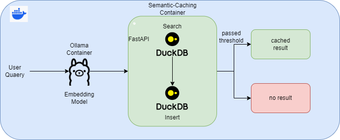
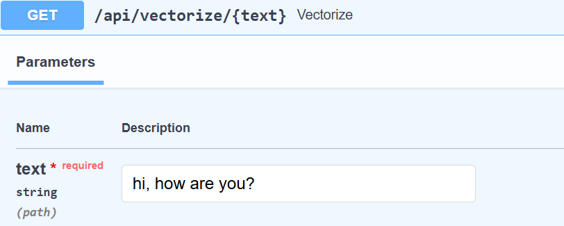
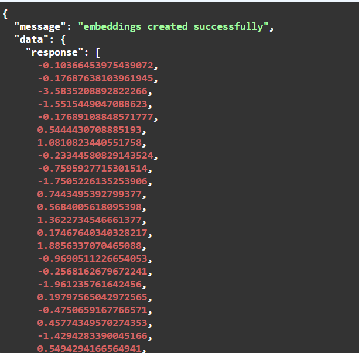
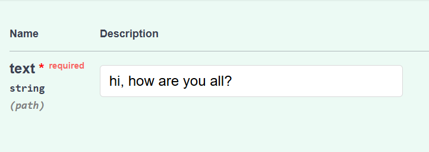
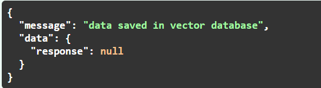

# Tiny Semantic Caching



## Description:

Semantic Caching is an In-Memory Database that support Semantic Search (Vector Search), it can be used in many different applications like RAG (Retrieval Augmented Generation), Database Assistant, and many more..
Designing a high performance applications that uses LLMs requires handling alot of issues like Time-Complexity, and avoidance of repeatable calls.
Semantic Caching can help and save time and computational resources when designing applications like this.
Tiny Semantic Caching is a project that uses Ollama and Vector Search in Duckdb to create complete semantic caching cycle.

## Prerequisities:

- Python (>=3.10)
- [Poetry](https://python-poetry.org/)
- [Ollama](https://ollama.com/)
- [Docker](https://www.docker.com/)
- Basic Understanding of Vector Indexing & Vector Search.

## Project Setup:

- Install all Prerequisities Softwares required for this project.
- install requirements

```bash
poetry install
```

- copy all containt of .env.example to .env file / rename .env.example to .env .
- get an embedding model from Ollama like `nomic-embed-text`
```bash
ollama pull nomic-embed-text
```
make sure to update model name/embedding size in .env file if you used other embedding model.

- to test the project locally
```bash
## use this directly
poetry run uvicorn main:app --reload

## or use this to activate the environment first
poetry shell
## then test the API
uvicorn main:app --reload
```
use the following URL to test the functionalities `http:localhost:8000/docs`

- if no issues locally, use the docker-compose file to build the containers
```bash
### build the images
docker-compose build
## run the docker-compose file
docker-compose up -d
```

## How it Works?

There are 4 different Functionalities:

1. vectorize (GET):
convert Passed Text to Vector Using the Embedding Model





2. insertion (POST):
insert data and its embeddings to caching database.

3. search (POST):
search for similar/identical text based on passed text.
here text is vectorized then search in caching database, last thing it to insert it.





4. refresh (DELETE):
refreshing database to clear all records from it.

## Usage:

- feel free to update the scripts based on your needs and run the docker compose file.
- use the direct image without any update by
```bash
## go to scripts directory
cd scripts
## run the docker compose file
docker-compose up -d
```